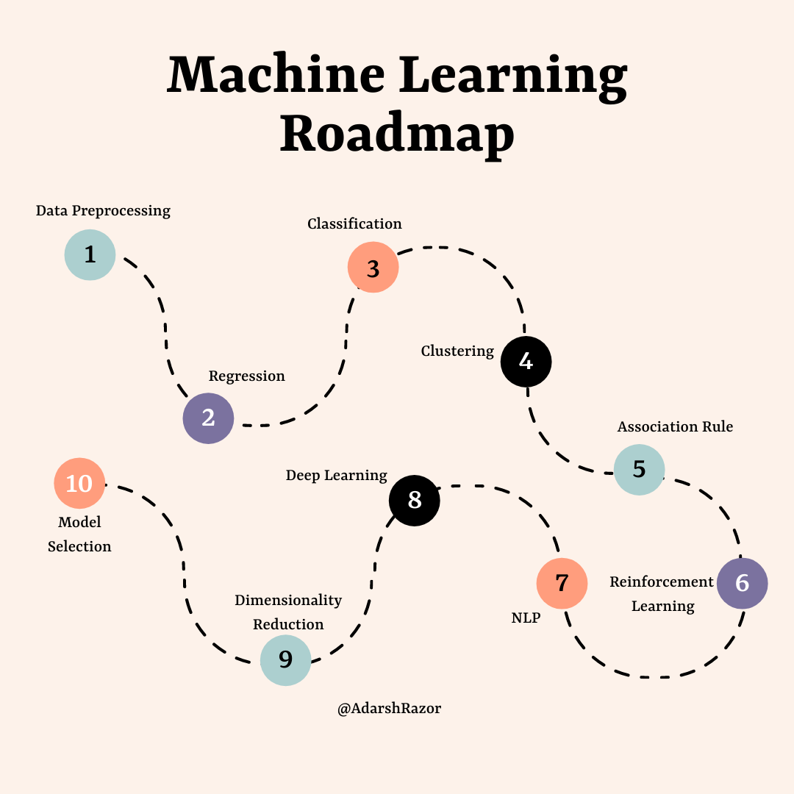

# Learning_ML_Stuff_Roadmap
 
## Roadmap to ML

This is a basic roadmap to make you understand the concept of Machine Learning. Hope you are excited and even I am to share my point of view with you all. Please go through the stuffs and let me know if there is anything to be changed. Eveyone learn new things everyday, so 
Happy Learning.

## Content

1. Data Preprocessing
2. Regression Methods
3. Classification Methods
4. Clustering Methods
5. Association Rule Methods
6. Reinforcement Learning Methods
7. Natural Language Processing
8. Deep Learning 
9. Dimentionality Reduction
10. Model Selection and Boosting ( Some high level stuffs )

 

 

## 1. Data Preprocessing

Data preprocessing is one of the important step in training machine learning model. We get a variety of training data from the internet and use it to train and predict. Many a times not all the data are **similar to one another** or many be user can encounter one or may be more **missing values** in the training data. 

It's not just limit to manage data but we also learn about the importing the important **libraries** and how we can import **dataset.** Splitting the data into training and testing also comes under the data preprocessing.

Topics under data preprocessing are as follows:

- Importing Libraries
- Importing Dataset
- Missing Data
- Categorical Data
- Splitting the Dataset
- Feature Scaling

 

## 2. Regression Methods

Regression is a machine learning method that allow us to predict a continuous outcome based on the value on one or multiple variables (x). 

Here are some of the examples of Regression Methods.

Topics under data preprocessing are as follows:

- Simple Linear Regression
- Multiple Linear Regression
- Polynomial Regression
- Support Vector Regression
- Decision Tree Regression
- Random Forest Regression

 

## 3. Classification Methods

Classification refers to a predictive modeling problem where a class label is predicted for a given example of input data. 
Examples of classification problems includes: differentiate between dogs and cat, spam and authentic mails, etc.

- Logistic Regression
- K-Nearest Neighbors
- Support Vector Machine
- Kernel SVM
- Naive Bayes
- Decision Tree Classification
- Random Forest Classification

